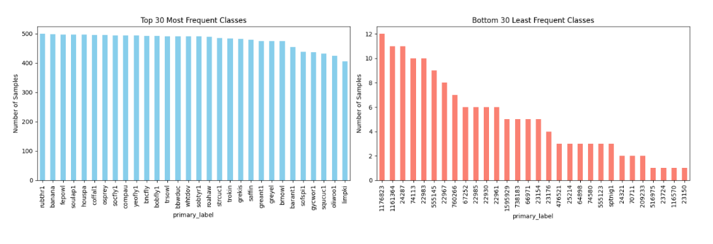
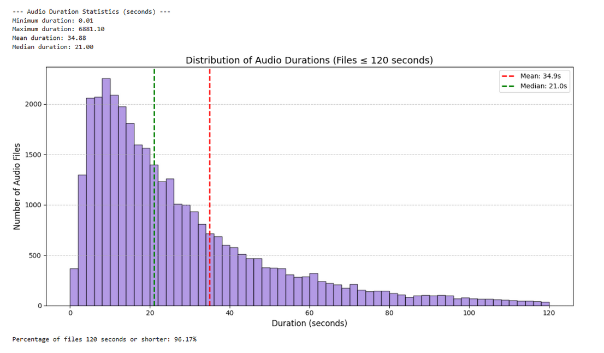
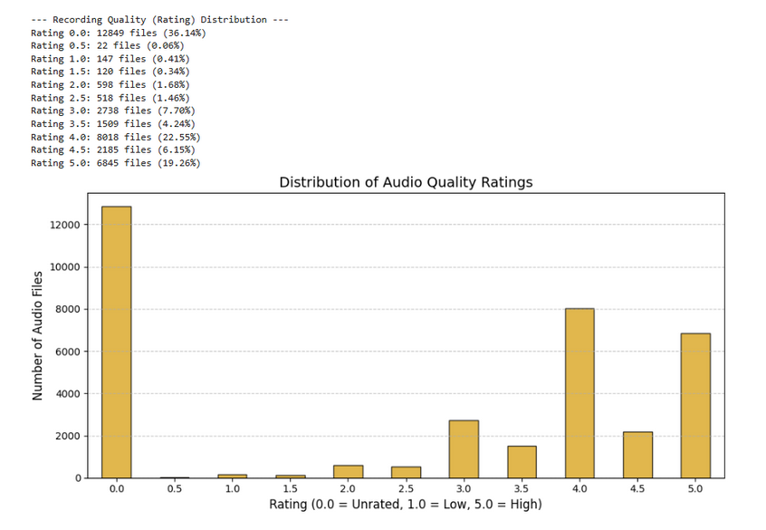
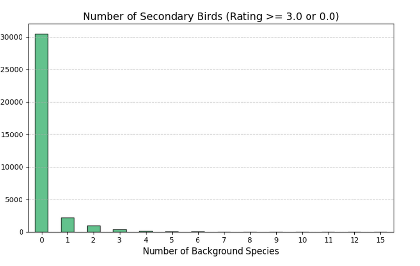
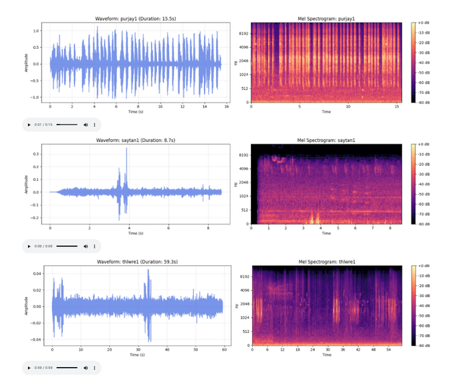
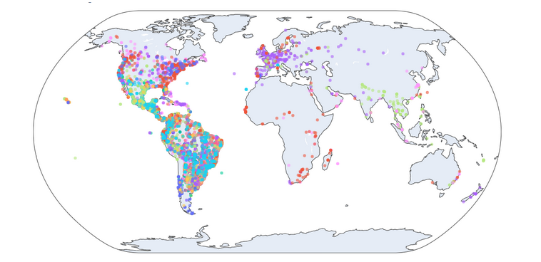
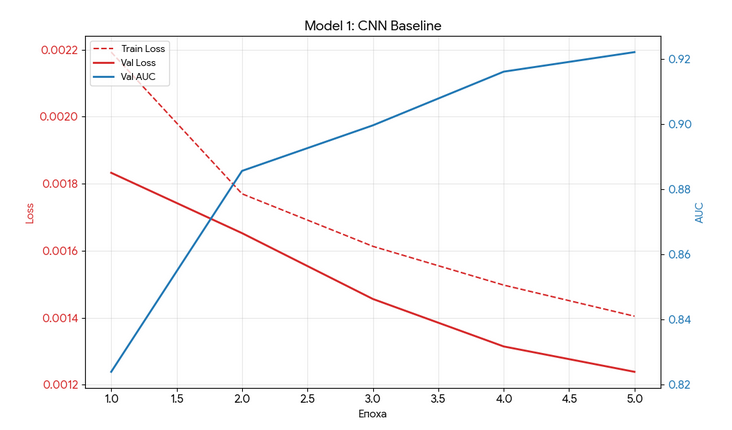
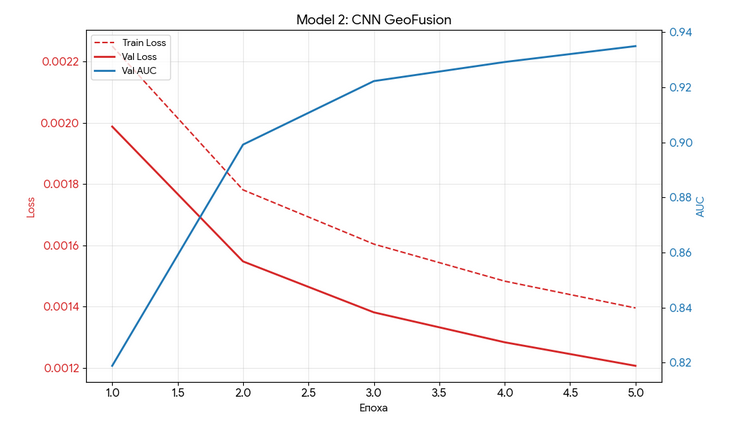
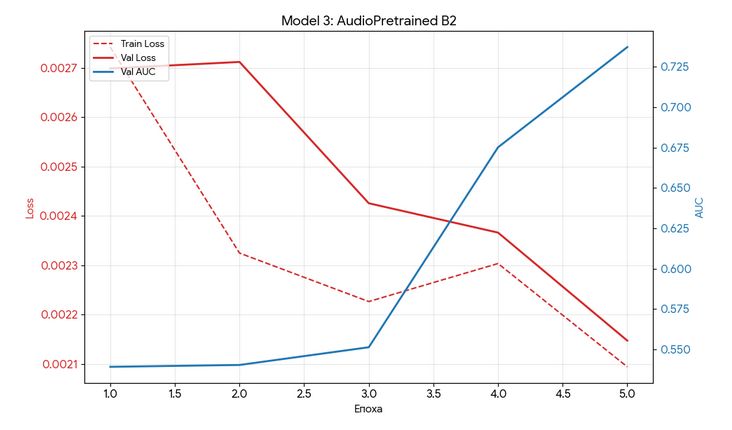
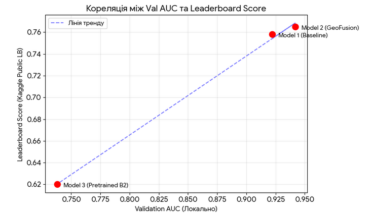

## **ЗВІТ** 
**про виконання лабораторної роботи № 2** 
**з дисципліни “Інтелектуальна обробка голосової інформації”** 

**Варіант 1** 

**Виконали:** 
Студенти 5 курсу групи КІ-51 мп 
Архипов Яків, 
Польнікова Поліна, 
Ткаченко Марія 

---

## ЗМІСТ
* [ЗАВДАННЯ (ВАРІАНТ 1)](#завдання-варіант-1)
* [ХІД РОБОТИ](#хід-роботи)
* [1. ОГЛЯД ДАНИХ, ОСНОВНІ ОСОБЛИВОСТІ Й ПРОБЛЕМИ](#1-огляд-даних-основні-особливості-й-проблеми)
    * [1.1. Дисбаланс класів та представленість видів](#11-дисбаланс-класів-та-представленість-видів)
    * [1.2. Тривалість записів та частота дискретизації](#12-тривалість-записів-та-частота-дискретизації)
    * [1.3. Оцінки якості аудіо та наявність фонових видів](#13-оцінки-якості-аудіо-та-наявність-фонових-видів)
    * [1.4. Проблеми співвідношення "Сигнал/Шум" та слабкої розмітки](#14-проблеми-співвідношення-сигналшум-та-слабкої-розмітки)
    * [1.5. Геопросторовий аналіз](#15-геопросторовий-аналіз)
    * [1.6. Висновки до розділу 1](#16-висновки-до-розділу-1)
* [2. АНАЛІЗ ІСНУЮЧИХ РІШЕНЬ ТА ТЕОРЕТИЧНИЙ ОГЛЯД](#2-аналіз-існуючих-рішень-та-теоретичний-огляд)
    * [2.1. Математичні основи та цифрова обробка Mel-спектрограм](#21-математичні-основи-та-цифрова-обробка-mel-спектрограм)
    * [2.2. Архітектура SED-голови та механізми локалізації звукових подій](#22-архітектура-sed-голови-та-механізми-локалізації-звукових-подій)
    * [2.3. Аналіз та реалізація рішення Бабича](#23-аналіз-та-реалізація-рішення-бабича)
    * [2.4. Аналіз та реалізація рішення команди volodymyr vialactea](#24-аналіз-та-реалізація-рішення-команди-volodymyr-vialactea)
    * [2.5. Аналіз та реалізації штрафування моделі](#25-аналіз-та-реалізації-штрафування-моделі)
    * [2.6. Висновки до розділу 2](#26-висновки-до-розділу-2)
* [3. СИСТЕМА ВАЛІДАЦІЙ](#3-система-валідацій)
* [4. ОПИС ВИКОРИСТАНИХ ПІДХОДІВ](#4-опис-використаних-підходів)
    * [4.1. Підхід №1: Базовий CNN (EfficientNet-B0 Baseline)](#41-підхід-1-базовий-cnn-efficientnet-b0-baseline)
    * [4.2. Підхід №2: Мультимодальна модель (CNN + Geocoordinates)](#42-підхід-2-мультимодальна-модель-cnn--geocoordinates)
    * [4.3. Підхід №3: Покращений бекбон та 2-стадійне навчання](#43-підхід-3-покращений-бекбон-та-2-стадійне-навчання)
    * [4.4. Спільні методи оптимізації та навчання](#44-спільні-метрики-оптимізації-та-навчання)
* [5. ТАБЛИЦІ МЕТРИК ЯК НА ВАЛІДАЦІЇ ТАК І НА LEADERBOARD](#5-таблиці-метрик-як-на-валідації-так-і-на-leaderboard)
* [6. ПОРІВНЯННЯ З ПОПЕРЕДНІМИ ЗМАГАННЯМИ ТА АНАЛІЗ МЕТРИК](#6-порівняння-з-попередніми-змаганнями-та-аналіз-метрик)
* [7. ГІПОТЕЗИ Й ДУМКИ, ЩОДО ОТРИМАНИХ РЕЗУЛЬТАТІВ](#7-гіпотези-й-думки-щодо-отриманих-результатів)

## ЗАВДАННЯ (ВАРІАНТ 1) [$\uparrow$](#top)

Вирішити задачу розпізнавання співу птахів на прикладі **BirdCLEF+ 2026**.
1. Проаналізувати існуючі рішення (BirdCLEF+ 2025).
2. Провести Exploratory Data Analysis (EDA).
3. Побудувати систему валідації.
4. Проаналізувати метрики та запропонувати альтернативи.
5. Розробити як мінімум 3 підходи (моделі).
6. Провалідувати рішення та завантажити на Kaggle (Leaderboard).
7. Проаналізувати кореляцію валідаційних метрик і Leaderboard.
8. Порівняти поточне змагання з попередніми.

## ХІД РОБОТИ [$\uparrow$](#top)

### 1. ОГЛЯД ДАНИХ, ОСНОВНІ ОСОБЛИВОСТІ Й ПРОБЛЕМИ [$\uparrow$](#top)

Під час розвідувального аналізу даних (EDA) тренувального набору BirdCLEF було досліджено метадані та аудіофайли для виявлення ключових патернів, аномалій та потенційних проблем, які можуть вплинути на навчання моделі. Було виділено кілька критичних особливостей датасету.

#### 1.1. Дисбаланс класів та представленість видів [$\uparrow$](#top)

Змагання передбачає розпізнавання 234 видів птахів, однак аналіз тренувальних даних показав, що 28 видів повністю відсутні як в основних (primary_label), так і у другорядних мітках (secondary_labels). Таким чином, навчальна вибірка містить записи лише 206 унікальних класів.
Крім того, спостерігається сильний дисбаланс класів. Деякі поширені види мають понад 500 аудіозаписів, тоді як рідкісні види представлені лише 1–5 файлами.

Рисунок 1.1 – Гістограма розподілу кількості записів за класами

Такий дисбаланс може призвести до перенавчання на мажоритарних класах, тому дуже важливо буде це врахувати.

#### 1.2. Тривалість записів та частота дискретизації [$\uparrow$](#top)

Аудіофайли мають суттєво різну тривалість. Більшість записів тривають до 1 хвилини, однак зустрічаються файли тривалістю понад годину. Проблема – правилами змагання передбачено оцінювання 5-секундних вікон.

Рисунок 1.2 – Розподіл тривалості аудіофайлів

Перевірка частоти дискретизації (Sample Rate) показала, що всі файли записано з частотою 32 000 Гц, як і було заявлено.
У наданих метаданих повністю відсутня часова розмітка. Датасет містить мітки лише на рівні всього файлу, тобто відомо, що птах присутній у записі, але немає точних часових міток початку та кінця його вокалізації, що також породжує проблеми.

#### 1.3. Оцінки якості аудіо та наявність фонових видів [$\uparrow$](#top)

Аналіз колонки рейтингів показав, що понад 36% даних взагалі не мають оцінки (0.0), що характерно для джерел на кшталт iNaturalist. Серед розмічених файлів переважають записи високої якості (оцінки 3.0–5.0). Наявність дробових оцінок (наприклад, 3.5) пояснюється автоматичним зниженням базового балу на 0.5 за присутність фонових птахів на записі. З датасету було вилучено записи з рейтингом від 0.5 до 2.5.

Рисунок 1.3 – Гістограма розподілу оцінок якості

Щодо фонових видів: аналіз показав, що майже 90% записів містять лише голос основного птаха ("соло"). Переважання "чистих" аудіо не відповідає реальним умовам лісу, де птахи співають одночасно.

Рисунок 1.4 – Стовпчаста діаграма кількості фонових птахів

#### 1.4. Проблеми співвідношення "Сигнал/Шум" та слабкої розмітки [$\uparrow$](#top)

Перетворення аудіо на Мел-спектрограми та їх візуальне (і слухове) дослідження на конкретних прикладах розкрило найголовнішу проблему датасету – так звану "слабку розмітку". 
На багатьох довгих записах птах співає лише кілька секунд, а решта часу – тиша. Випадкове вирізання 5-секундного вікна з такого файлу неминуче згенерує для моделі навчальний приклад, де цільового сигналу фізично немає. Гучні артефакти (наприклад, пориви вітру) на спектрограмі можуть виглядати яскравіше за спів самого птаха. Модель може помилково навчитися асоціювати гучний вітер із певним видом. Широкосмуговий шум часто перекриває тихі вокалізації.

Рисунок 1.5 - Візуалізація осцилограм та Мел-спектрограм

#### 1.5. Геопросторовий аналіз [$\uparrow$](#top)

Побудова інтерактивної карти місць запису аудіофайлів виявила яскраво виражене географічне упередження. Основний масив даних сконцентрований у Північній/Південній Америці та Європі. Африка, Азія та Австралія представлені мінімально. Модель може запам'ятати специфічний акустичний фон певного континенту, а не сам голос птаха.

Рисунок 1.6 – Географічна карта розподілу тренувальних даних

#### 1.6. Висновки до розділу 1 [$\uparrow$](#top)

Проведений розвідувальний аналіз даних (EDA) підтвердив, що тренувальний датасет є складним і максимально наближеним до реальних "польових" умов. Головними викликами для майбутньої моделі стануть сильний дисбаланс класів, відсутність точної часової розмітки та значні перешкоди у вигляді нестабільного співвідношення сигнал/шум.

### 2. АНАЛІЗ ІСНУЮЧИХ РІШЕНЬ ТА ТЕОРЕТИЧНИЙ ОГЛЯД [$\uparrow$](#top)

#### 2.1. Математичні основи та цифрова обробка Mel-спектрограм [$\uparrow$](#top)

У цьому розділі розглядається процес перетворення сирого аудіосигналу у візуальне представлення, придатне для аналізу згортковими нейронними мережами, з урахуванням особливостей біоакустики.

Ми подаємо батчі мел-спектрограм у будь-яку згортку.

Зауважимо, що Mel-спектограма базується на особливостях людського (і загалом тваринного) слуху. Оскільки люди дуже добре розрізняють зміни в низьких частотах, але погано — у високих. Mel-шкала стискає високі частоти і розтягує низькі.

Фільтрація та стиснення даних (n_mels), оскільки звичайна спектрограма після перетворення Фур'є містить величезну кількість даних (наприклад, 2049 значень частот для n_fft=4096). У Mel-спектрограмі ми застосовуємо набір трикутних фільтрів (Filter Banks), які групують ці тисячі значень у невелику кількість «бінів» — n_mels.
* **У розв'язку Бабича це було 224 біни, у Сидорського — 128 бінів.** Це критично для нейромереж: ми викидаємо зайвий математичний шум і залишаємо лише ті «смуги», де міститься корисна інформація про голос птаха.
* Звичайне перетворення Фур'є видає амплітуду. Проте ми сприймаємо гучність теж не лінійно. Тому Mel-спектрограму майже завжди переводять у логарифмічну шкалу (децибели) за допомогою операції AmplitudeToDB. Це дозволяє моделі однаково добре "чути" як дуже тихі звуки на фоні, так і дуже гучні крики поблизу мікрофона.

Зауважимо, що якби використовувалася звичайну спектрограму, вісь Freq у тензорі (Batch, Channels, Freq, Time) була б надто великою (наприклад, 2049). Більшість цих даних були б порожніми або містили б неважливий високочастотний шум.

Після перетоврення Фур'є, де для кожного вікна маємо конкретну к-сть частот, які виділилося перетворення Фур'є, це зазвичай дуже багато (n_fft=2048 для кожного вікна - *друга половина — це просто дзеркальне відображення першої (від'ємні частоти)*). 
* Точка №0 (0 Гц) — 1 штука.
* Точки від №1 до №1023 (корисні частоти) — 1023 штуки.
* Точка №1024 (частота Найквіста) — 1 штука. Завжди дорівнює половині частоти дискретизації, тобто якщо звукова карта записує звук із частотою 32 000 Гц (як у змаганні BirdCLEF), то частота Найквіста буде 16 000 Гц. Це означає, що все, що звучить вище за 16 кГц, ти вже не зможеш правильно оцифрувати.
* Точки від №1025 до №2047 (дзеркальні частоти) — 1023 штуки.
Треба зменшувати! Тож, використовуємо так званий **Mel Filter Bank** (Набір Mel-фільтрів), яка відбувається тільки по осі частот (вертикально) для кожного конкретного моменту часу окремо. 
* для трикутника у центрі вага завжди буде 1, по краям 0, а між краєм та центром вага змінюється пропорційно відстані.
* трикутники збільшуються за шириною, оскільки Mel-шкала логарифмічна, аби сприймали крок «однаково», на високих частотах потрібно охоплювати дедалі більший діапазон Герц. *Він ніколи не зменшується назад, бо наша здатність розрізняти частоти падає зі зростанням висоти звуку*
* * На низьких частотах (наприклад, 200 Гц) трикутник може мати ширину лише 50 Гц.
* * На високих частотах (наприклад, 12 000 Гц) той самий за «відчуттям» трикутник може мати ширину 2000 Гц.
* трикутники «сунуться» рівно на відстань між своїми вершинами, що створює 50% накладання площ сусідніх трикутників. Кожна частота Фур'є завжди обробляється двома фільтрами одночасно.
* якщо обирати M=224 трикутники, то на виході для кожного моменту часу (Time) отримається рівно 224 числа.
* * Будь-який трикутник математично задається лише 3 точками на осі частот — Лівий край (вага 0), Центр (вага 1.0), Правий край (вага 0). Ці 3 точки визначають нахил його «схилів».
* * Скільки саме чисел із 2049 потрапить у трикутник, залежить від його ширини.
* * * У вузький низькочастотний трикутник може потрапити лише 2–4 частоти Фур'є. Саме тому на низьких частотах модель бачить дуже детальну картинку (кожна частота майже окремий бін).
* * * У широкий високочастотний трикутник можуть потрапити сотні частот Фур'є (наприклад, 300–400 значень). Тож, на високих частотах модель бачить «середню температуру по палаті», бо один бін змішує сотні частот.
* Щоб визначити інтервали (центри  рикутників, куди їх ставити).
1. Необхідно спочатку визначити діапазон Герц у вікнах, наприклад, для BirdCLEF це від 0 до 16000 ГЦ. Переводимо ці межі в Мели за формуло. $m=2595*log_{10}(1+\frac{f}{700})$. Отже, підставивши межі, які в ГЦ (0 та 16000) у формулу - отримаємо 0 та 3570 Мел.
* * числа 700 та 2595 це константи, де 700 кутова частота, бо все що нижчу 700 ГЦ ми сприймає лінійно, вище 700 вже сприймає логарифмічно (тобто майже не відчуємо різницю між 10 000 Гц та 10 010 Гц - «один і той самий високий писк»). 2595 це коефіцієнт масштабування, для зручності в розрахунку, щоб кругле число в Герціх відповідало круглому числу в Мелах, 1000 Гц давало 1000 Мел, а не якесь дуже маленьке число як 0.385.
2. Потім ділимо проміжок на відповідну к-сть інтервалів, тобто якщо треба аби було 224 біни, а нам потрібно 226 точок (щоб у кожного трикутника був лівий край, центр і правий край сусіднього). Треба поділити на 225, щоб накладалися 224 трикутників на 224 відрізки. $3570/225 \approx15.86$. Отже, 15.86 це крок у Меліх, тож центри трикутників у мелах будуть стояти в точках: 0, 15.86, 31.72, ..., 3570.
3. Оскільки будемо накладати трикутники на шкалу у Гц, що видала згорстка, то переведемо центри трикутників $m$ з Мелів у Герци за зворотньою формулою: $f=700(10^{\frac{m}{2595}-1})$. Отже, це буде: $0,m_1=10 Гц,...,m_100=2160 Гц, ..., 16000Гц$
4. Тепер треба перевести ці Герци в індекси масиву з 2049 чисел за формулою: $index=f*\frac{n_fft}{SR}$ тобто для BirdCLEF: $index=f*\frac{4096}{32000}$. Тож, $10 Гц -> 10*0.128\approx1.28 -> індекс 1; ...; 2160 Гц -> 2160*0.128\approx276.4 -> індекс 276$

*Це ідеально відповідає голосам птахів: їхні низькі звуки часто потребують точності, а високі свисти можна сприймати як загальну смугу енергії.*

* Наприклад, щоб отримати 224 біни, нам потрібно не 224, а 226 опорних точок $(M+2)$, тобто ще додаткові 2 точки це лівий та приваий краї, початок першого трикутника та кінець останнього відповідно. Та 224 вершини, що є центрами 224 трикутників. *Ми ділимо шкалу Mel на 225 рівних відрізків, а потім переводимо ці точки назад у Герци.* Бо якби поділимо Герци на 225 рівних частин, отримали б звичайну лінійну спектрограму. Але хочемо імітувати вухо.
* * На низьких частотах: коли ми переводимо рівні відрізки Мел-шкали назад, точки в Герцах виходять дуже густими (наприклад, кожні 20 Гц). Це дає моделі дуже детальну картинку низьких звуків.
* * На високих частотах: ті самі рівні відрізки Мел-шкали після перетворення в Герци стають гігантськими інтервалами (наприклад, кожні 1000 Гц).
* * Що, якщо в інтервалі немає жодної частоти? Навіть якщо трикутник дуже вузький, він все одно «зачепить» найближчі частоти Фур’є через накладання. Однак у сучасних бібліотеках використовується нормалізація: площу кожного трикутника роблять рівною 1. Це означає, що вузькі трикутники (де мало частот) мають «вищі» піки, а широкі (де сотні частот) — «нижчі». Це вирівнює енергію по всьому спектру.

*Отже, птахи та комахи часто мають дуже високі голоси. Якби Бабич не збільшував ширину трикутників (використовуючи лінійну шкалу), високі звуки могли б «провалюватися» між вузькими фільтрами або створювати забагато шуму. Mel-шкала дозволяє моделі бачити високі частоти так само «чітко» (з точки зору важливості), як і низькі.*

#### 2.2. Архітектура SED-голови та механізми локалізації звукових подій [$\uparrow$](#top)

Після того, як бекбон (наприклад, EfficientNet або ResNet) обробив спектрограму, отримується тензор вигляду (Batch, Channels, Freq, Time).

* Batch, це к-сть різних Mel-спектограм, які подавалися на вхід
* Channels це те саме, що канали в звичайній CNN (наприклад, 1280 каналів у EfficientNet-B0). Кожен канал "шукає" щось своє: один може реагувати на різкий свист, інший — на низьке гудіння, третій — на ритмічне цвірінькання.
* Freq це вертикальна вісь Mel-спектрограми, але сильно стиснута бекбоном. *Якщо на вході було 128 Mel-бінів, то після страйдів мережі (наприклад, 1/32) залишиться лише 4. Це "стисла" інформація про те, в якому діапазоні (низькому, середньому чи високому) мережа знайшла ознаки.*
* Time це горизонтальна вісь (часова шкала), теж стиснута мережею. *Наприклад, було 512 часових кроків, стало 16. Кожне з цих 16 чисел тепер репрезентує не 40 мс, а великий блок часу (наприклад, ~1.25 секунди). Це і є часова шкала. Якщо в 3-му блоці з 16-ти є висока активація, значить, птах співав десь на початку запису.*

Тепер для цеглинка заходить у SED-голову (Sound Event Detection). Наприклад, для EfficientNet-B0 після всіх страйдів це може бути (B, 1280, 4, 16).

**1. Frequency Pooling.**

Для SED нам не потрібно знати, в якому саме з 4-х залишку бінів «сидить» птах. Бекбон вже витягнув усю частотну інформацію в канали (Channels). Тому ми позбуваємося осі Freq. Як це робиться?
* Зазвичай використовується AdaptiveAvgPool2d((1, None)), що є іструментом у PyTorch, що реалізовує ідею Global Average Pooling (GAP), або просто mean(dim=2). Тобто, якщо було (B, 1280, 4, 16), то для кожного з 16 часових кроків мережа бере 4 значення частотних бінів і обчислює їхнє середнє. Це відбувається незалежно для кожного каналу. 
* *Тензор перетворюється з (B,C,F,T) на (B,C,T).* Оскільки після усередення, наприклад, було $(B, 1280, 4, 16) -> (B, 1280, 1, 16)$. Після чого вимір зі значенням 1 зазвичай видаляється через squeeze, залишаючи (B, 1280, 16)).
* Тепер у кожному часовому кроці (T) у нас є вектор ознак довжиною C, який описує все, що відбувалося на всіх частотах одночасно.

**2. Тепер нам треба перетворити ці 1280 каналів у кількість класів птахів (наприклад, 264 види).**

а) Використати класифікаційний шар (Pointwise Convolution). Пропускаємо тензор крізь лінійний шар або згортку 1×1. Тож, тензор стає вигляду (B, Classes, T).
Це і є наші frame-level predictions (прогнози для кожного кадру). Якщо в 5-му часовому кроці значення для «Зяблика» високе — значить, він співав саме в цей проміжок часу.
* Зауважимо, **для кожного класу існує свій унікальний набір ваг** Коли ми створюємо шар nn.Conv1d або nn.Linear, ми вказуємо кількість вихідних каналів (наприклад, 264 класи птахів). Це означає, що всередині цього шару створюється 264 різні фільтри (або 264 вектори ваг).
* * Фільтр для Зяблика: має 1280 ваг.
* * Фільтр для Сови: має свої 1280 ваг.
* * Фільтр для Орла: має ще інші 1280 ваг.
Коротко і просто: кожен такий фільтр — це «рецепт», який каже: «Візьми 20% ознак з каналу №5, відніми 10% з каналу №100 і додай 50% з каналу №1200 — і ти отримаєш ймовірність того, що це я».
Тобто фінально ваг буде 264*1280 = 337 920 параметрів

б) У розв'язках (як у Бабича) просто лінійного шару замало. *Чому? Бо в 5-секундному записі птах може співати лише 0.5 секунди, а все інше — це шум вітру. Якщо ми просто візьмемо середнє, то 4.5 секунди шуму «розмиють» той короткий спів, і модель видасть низьку ймовірність.* Використовується Attention-based Pooling, змушуючи модель саму обирати, на які моменти часу звертати увагу. Це працює так. 

Тензор ознак (B,C,T) виходить після бекбону та Frequency Pooling, ми розгалужуємо його на дві окремі «голови» (зазвичай це дві згортки 1×1). 

*нам потрібно зробити дві речі: зрозуміти, що звучить, і вирішити, коли звук був найбільш чистим.*

1. Шлях Класифікації (Classification Head). Аналогічно застосовуємо згортку 1х1, аби перетворити, наприклад, 1280 абстрактних ознак у 264 конкретні класи птахів. Результатом буде тензор вигляду (B, 264, 16). Це Frame-level predictions — сирі прогнози (логіти) для кожного з 16 кадрів.
2. Attention Head (Шлях «Уваги»). Паралельно з класифікацією створюється ще одна згортка 1×1, яка видає ваги важливості для кожного кадру. Аналогічна згортка, де результатом буде тензор (B,264,16). Ми пропускаємо його крізь Softmax по осі часу, щоб сума ваг для кожного птаха дорівнювала 1.

*Навіщо це? Бо в аудіо часто буває багато шуму (вітер, дощ). Attention буде казати моделі: «Ігноруй кадри 1–5, там тільки шум, але дивись на кадр 12 — там голос птаха найчіткіший».*

3. Фінальне об’єднання (Weighted Sum)

Тепер ми множимо прогнози кожного кадру на їхню «вагу важливості» і додаємо їх: $Y_{clip}=\sum_{t=1}^{16} \operatorname{Softmax}(x_{attn})_t \cdot \operatorname{Sigmoid}(x_{cls})_t$

* Sigmoid: «Чи є тут птах?» (Незалежність). Він застосовується до кожного кадру окремо. Йому байдуже, що відбувається в сусідніх кадрах. його логіка проста: «Я дивлюся на кадр №5. Якщо я бачу там Зяблика, я ставлю 0.9. Якщо я бачу там ще й Сову, я і їй ставлю 0.8». Тож, у одному кадрі може бути багато птахів одночасно. Сума значень по кадру може бути хоч 10.0, хоч 100.0.
* Softmax «Який момент найважливіший?» (Конкуренція). Логіка така: «У мене є всього 1.0 (100%) "бюджету уваги" на весь 5-секундний запис. Якщо я віддам 0.9 кадру №12 (бо там найчистіший звук), то на всі інші 15 кадрів у мене залишиться лише 0.1». Тому сума всіх 16 значень по осі часу для конкретного птаха завжди дорівнює 1.0. Оскільки хочемо відфільтрувати шум. Softmax «видавлює» шумні кадри до нуля, щоб підсвітити лише той один-єдиний момент, де сигнал найсильніший. Зауважимо, **щоб видати результат для одного кадру, Softmax мусить побачити всі 16 кадрів одразу.**

---

*Що робити якщо класи є приховані?*
 
1. Метод «Поріг впевненості» (Thresholding). Найпростіший, якщо жоден із 256 класів не набрав більше ніж 0.3 (або інший поріг), ми вважаємо, що це «Unknown» або просто шум. Однак, якщо нейромережа «надвпевненими» (overconfident). Модель може видати 0.8 на незнайомого птаха просто тому, що його тембр трохи схожий на Зяблика.
2. Ембеддинги та Метричне навчання (Metric Learning). Замість того, щоб дивитися тільки на фінальні 264 класи, ми дивимося на вихід бекбону — вектор ознак (Embedding) довжиною 1280. Отже, всі Зяблики в просторі ознак збираються в одну «хмару», Сови — в іншу. Коли приходить незнайомий птах, його вектор (ембеддинг) приземлиться десь далеко від усіх знайомих хмар. Якщо відстань від нового звуку до найближчого центру знайомого класу занадто велика — це 100% «прихований» клас або аномалія.
3. Клас «Фон» або «Інше» (Background Class). Додати спеціальний 257-й клас, куди під час тренування «скидають» усе: вітер, дощ, кроки людей, шум літаків. Однак наколи не збиреться датасет із «усіма іншими звуками світу». Прихований птах може бути занадто схожим на справжній спів, щоб потрапити в цей клас.
4. Температурне масштабування та Ентропія. Можна виміряти «рівень розгубленості» моделі (ентропію). Якщо модель впевнено каже «Зяблик — 0.9, інші — 0.01» — це знайомий клас. Якщо модель видає «Зяблик — 0.3, Сова — 0.25, Орел — 0.2» — це означає, що вона бачить щось схоже на багатьох одразу, але ні на кого конкретно. Це ознака того, що перед нами новий клас.

*Найкращий захист від прихованих класів — це Contrastive Learning (наприклад, використання ArcFace або Triplet Loss). Так модель вчиться не просто «ставити галочку» навпроти назви птаха, а розуміти унікальний «відбиток голосу». Якщо відбиток не схожий на жоден із бази — ми його ігноруємо.*

Тож, треба змінити такі елемнети в архітектурі:

1. Зміна Loss-функції (Metric Learning). У звичайній моделі ми використовуємо CrossEntropyLoss. Вона просто каже: «Зроби так, щоб імовірність правильного класу була 1.0». Їй байдуже, наскільки далеко один від одного знаходяться «Зяблик» та «Сова» у просторі ознак. Отже, щоб **бачити нові класи, замінюємо CrossEntropyLoss на ArcFace, CosFace або Triplet Loss.** Отже, модель починає вчитися так, щоб усі записи одного виду птаха були в дуже щільній «хмарі» (кластері), а між різними видами була велика порожнеча (зазор/margin). Тепер є «мапа» звуків. Якщо новий звук потрапляє в порожнечу між відомими кластерами — це 100% новий клас.
2. Використання Ембеддингів замість Логітів. Беремо вихід бекбону перед класифікацією (наш вектор довжиною 1280). Під час тестування ми не просто дивимося на «Sigmoid», а рахуємо косинусну відстань між цим вектором та еталонними векторами птахів, які ми зберегли під час тренування. Якщо подібність до найближчого птаха менша за 0.4, ми сміливо кажемо: «Я не знаю, хто це, але це точно не хтось із моїх 256 знайомих».
3. Додавання «Шумового» класу (Trash Class). Ми додаємо в тренування величезну кількість звуків, які не є птахами (бензопили, літаки, людська мова, дощ), аби модель вчиться виділяти ознаки, які роблять птаха — птахом. Коли модель почує «прихованого» птаха, вона може не впізнати вид, але вона принаймні не переплутає його з вітром.
4. Можна змінити спосіб обчислення впевненості. Ми додаємо параметр Temperature (T) у Softmax: $\sigma(x)_i=\frac{e^{\frac{x_i}{T}}}{\sum_{j}{}e^{\frac{x_j}{T}}}$. Якщо ми збільшуємо T, розподіл стає більш «пласким». Це допомагає під час тестування краще бачити, коли модель «сумнівається» (ентропія висока). Велика розгубленість моделі — це головний сигнал, що перед нами невідомий клас.

---

**3. Фінальні прогнози: Frame vs Clip**

На виході SED-голова зазвичай видає дві речі:

* Frame-level output: Ймовірності для кожного кадру (B,T,Classes). Це потрібно для локалізації звуку в часі.
* Clip-level output: Одна ймовірність на весь 5-секундний запис.
* * Де беруться кадри і «сплющуються» у часі. Але не просто через середнє значення (бо один гучний крик на фоні 4-х секунд тиші «розчиниться»), а через спеціальну формулу, наприклад Auto-Pooling або Log-Sum-Exp: $y_{clip} = log(\frac{1}{T}\sum_{t=1}{T} exp(y_t))$
* * * $exp(y_t)$ підноситься кожне значення в експоненту. Це «підсилювач». Якщо значення велике (впевнений спів), воно стає гігантським. Якщо маленьке (тиша) — воно залишається крихітним.
* * * $\sum_{t=1}{T} exp(y_t)$ додаються ці гігантські значення. Тепер один-два сильні піки домінують у всій сумі.
* * *  $\frac{1}{T}$ беремо середнє від цих експонент
* * * $log(...)$ повертаємо результат назад у нормальний масштаб, щоб число не було нескінченно великим.

#### 2.3. Аналіз та реалізація рішення Бабича [$\uparrow$](#top)

1. Архітектурна база: SED + GeM Pooling

Було використано архітектуру Sound Event Detection (SED), яка була описана вище, але з важливою модифікацією в механізмі агрегації.

* GeM (Generalized Mean) Frequency Pooling: замість звичайного середнього (AvgPool) він використав GeM pooling по осі частот. Це дозволяє моделі гнучкіше виділяти важливі частотні ознаки, де параметр p може бути навченим або фіксованим (у нього p=3). Тобто математика GeM Pooling: $GeM(x)=(\frac{1}{F}\sum_{f=1}^{F}x_{f}^{p})^{\frac{1}{p}}$, де
- $x_f$ це значення в конкретному частотному біні.
- $F$ кількість бінів (наприклад, у (B, C, F, T):(B, C, 4, 16) це 4).
- $p$ ступінь (параметр «гнучкості»).
* * Якщо $p=1$: Формула перетворюється на звичайне середнє значення (Average Pooling). Ми просто усереднюємо всі 4 біни.
* * Якщо $p=\infty$: Формула починає працювати як Max Pooling. Вона ігнорує все і бере тільки один найсильніший бін.
* * Якщо $p=3$: (як у Бабича): Це ідеальний компроміс. Модель приділяє більше уваги яскравим пікам (голосу птаха), але при цьому не ігнорує контекст навколо них так сильно, як це робить Max Pooling.

*Птахи часто співають у дуже вузькому діапазоні частот. Якщо в одному біні є чистий свист, а в трьох інших — порожнеча, звичайне середнє значення просто «вб’є» цей свист, зробивши його в 4 рази тихішим. GeM дозволяє цьому свисту «вижити» і пройти далі в SED-голову.*

* Вхідні дані: він подавав 3 повторення однієї Мел-спектрограми як 3 канали (RGB), що дозволило використовувати стандартні бекбони, навчені на ImageNet.
* Мел-параметри: використовував 224 Мел-біни та великий n_fft=4096. Це було критично для розрізнення комах (Insecta) та амфібій, чиї звуки часто зосереджені у вузьких частотних діапазонах.

2. Стратегія 20-секундних чанків

Це було одним із головних відкриттів Бабича. Він з'ясував, що для птахів достатньо 5 секунд, але для комах та жаб (Amphibia/Insecta) потрібні довші записи, оскільки їхні виклики дуже повторювані та тривалі. 

Однак  для нейромережі ця «картинка» (спектрограма) не стала в 4 рази більшою за розміром. Оскільки він збільшив крок вікна з 313 до 1252 без втрати швидкості, оскільки на виході ширина спектограми (32000*20)/1252=511 проти того, що було (32000*5)/313=512

*Для моделі EfficientNet-B0 в обох випадках на вхід приходить картинка шириною приблизно 512 пікселів. Тобто для відеокарти (GPU) навантаження однакове. Але в моделі Бабича в ці 512 пікселів «втиснуто» в 4 рази більше часу.*

Тобто коли створюється спектограма і застосовується перетворенння Фур'є береться шматок звуку. У Бабича це 4096 точок (n_fft=4096). І ось у стандартному 5-секундному підході ми стрибаємо на ∼312 семплів вперед після кожного Фур'є. Однак Бабич у своїй моделі стрибає на 1252 семпли вперед (hop_length=1252 (збільшено в 4 рази!)).

3. Multi-Iterative Noisy Student (Самонавчання)

Це «серце» його рішення. Коли він вперше спробував просто додати немарковані дані, це не спрацювало. Магія почалася, коли він перейшов до підходу Noisy Student.

У змаганні BirdCLEF дані зазвичай діляться на два типи:

* Focal recordings (Розмічені): це короткі записи конкретного птаха, де ми точно знаємо: «тут співає Зяблик».
* Soundscapes (Нерозмічені або слабо розмічені): це довгі (часто багатогодинні) записи дикої природи. Організатори дають їх у великій кількості, але вони не кажуть, хто і в яку секунду там співає. Саме їх Микита використав як «сировину».

Також він використовував додаткові дані з Xeno-Canto — це зовнішня база, де тисячі записів птахів, які теж можна використовувати для навчання.

* MixUp з псевдо-лейблами: він змішував чисті тренувальні дані з «шумними» немаркованими записами (soundscapes) у пропорції 0.5. Тобто він брав чистий запис птаха і на 50% накладає на нього шумний нерозмічений запис лісу. Учень має «почути» птаха крізь цей бруд.

Тобто він змінював амплітуду в аудіо! Оскільки він оброблював не 5 секунд, а 20 секунд (через жаб і комах), то маємо 2 аудіодоріжки по 20 секунд:

* Доріжка А: чистий запис птаха з датасету (focal data).
* Доріжка Б: шумний запис лісу (soundscape), для якого модель-вчитель уже зробила «пророцтво» (псевдо-лейбли).

Потім робиться змішування за формулою: $Результат=0.5×Доріжка А+0.5×Доріжка Б$

Тобто обидва звуки звучать одночасно протягом усіх 20 секунд, але кожен — у пів сили.

Варто зауважити, що бралася доріжка Б, яка вже було розмічена вчителем, крім того, зазвичай бралися ті немарковані записи, в яких модель-вчитель була найбільш впевнена (де сума ймовірностей псевдо-лейблів була високою). Тобто якщо уявити довгий запис лісу (soundscape), який триває, наприклад, 10 хвилин. Модель-вчитель «прослуховує» його і для кожного виду птаха (а їх 206+) видає ймовірності для кожного часового шматочка. Тому протягом усього запису для кожного кадру (який видав ймовірності, який там птах звучить) знаходився максимум (найвище значення (пік)) по кожному птаху. Наприклад: Птах А — макс. ймовірність 0.9. Птах Б — макс. ймовірність 0.1. Птах В — макс. ймовірність 0.8. а потім додава ці максимуми між собою (0.9+0.1+0.8+...).

Чому висока сума — це круто? Це означає, що вчитель чітко «почув» або одного птаха дуже впевнено, або цілий хор різних птахів. Це «багатий» на інформацію запис. Низька сума  означала, що модель-вчитель сумнівається щодо всіх. Швидше за все, там або суцільний шум вітру, або птахи десь занадто далеко. Бабич вважав такі записи «брудними» і менш корисними для навчання.

Він вважав, що «чистіші» псевдо-лейбли краще вчать модель.

Аналогічно, якщо чистий запис був коротший за 20 секунд? То цей коротший запис ставився у випадкове місце всередині 20-секундного вікна, а все інше заповнював нулями (тишею).

* Power Transform для очищення: щоб зменшити вплив помилкових прогнозів учителя, він застосовував степінь до отриманих ймовірностей псевдо-лейблів: $P_{new}=P_{old}^{p}$, де p>1. *Коли вчитель каже «ймовірність 0.7», це може бути помилкою. Якщо ми просто повіримо вчителю, учень вивчить його помилки.* Це працює як фільтр: низькі ймовірності стають майже нульовими, а високі (впевнені) — зберігаються. було застосовано степінь $P^{1.53}$, де $1.53 \sim \frac{1}{0.65}$\

* * Якщо ймовірність була 0.9 (впевнено): $0.9^1.53 \approx 0.85$ (залишилася високою).
* * Якщо ймовірність була 0.3 (невпевнено): $0.3^1.53 \approx 0.15$ (стала майже нульовою).

*Таким чином, він «загострює» впевненість: слабкі сигнали відсікаються, а сильні залишаються. Це очищує псевдо-лейбли від «сумнівів» вчителя.*

* Stochastic Depth: у процесі самонавчання він додавав drop_path_rate = 0.15 (Dropout для цілих блоків мережі). Він випадковим чином «вимикає» цілі шари в нейромережі під час навчання. Це змушує модель шукати обхідні шляхи для розпізнавання звуку, роблячи її набагато стійкішою.

4. Спеціалізована модель для жаб та комах

Оскільки ці групи були дуже слабо представлені в основному датасеті, Микита створив окрему модель (EfficientNet-B0), навчену виключно на Amphibia та Insecta з використанням додаткових 700 видів із Xeno-Canto.

Це дало приріст у 0.002–0.003 на Leaderboard.

5. Розумний інференс (Inference flow)

5.1 Sliding-window та Averaging Overlapping Predictions (саме фішкою інференсу (тестування))

*У процесі тренування нам не потрібно «прочісувати» кожну секунду файлу з накладанням. Навпаки, нам потрібна різноманітність, щоб модель не зазубрювала дані.*

Замість того, щоб просто різати аудіо на шматки по 5 секунд, він зробив «ковзне вікно».

* Як це працювало: Він брав 20-секундний шматок звуку, отримував для нього прогнози, а потім «сунувся» вперед не на 20 секунд, а лише на 5 секунд.
* Ефект накладання: Таким чином, кожен конкретний 5-секундний відрізок аудіо потрапляв у поле зору моделі 4 рази (як частина різних 20-секундних контекстів).
* Averaging (Усереднення): Замість того, щоб брати один прогноз, він усереднював результати всіх чотирьох «поглядів» моделі на цей відрізок.

Тож, у батчі під час інференсу (тестування) модель отримує не просто нарізані шматки, а серію «кадрів» одного і того самого аудіо, які дуже сильно накладаються один на одного.

*Це працює як Temporal TTA (Test-Time Augmentation). Якщо птах заспівав на самому краю вікна, модель могла його пропустити через брак контексту. Але завдяки накладанню, цей самий спів в іншому вікні опиниться в центрі, і модель його чітко розпізнає. Це підняло його результат (LB score) на 0.002–0.003.*

*Тобто хоча під час тестування (інференсу) ваги моделі «заморожені» і не змінюються. Але результат (Score) на Leaderboard піднімається, оскільки коли звук птаха потрапляє на 1-шу або 20-ту секунду вікна, у моделі немає контексту «збоку». Через це вона може видати низьку ймовірність (наприклад, 0.3), хоча звук чіткий. Однак, завдяки зміщенню на 5 секунд, цей самий звук у наступному вікні опиниться в центрі (на 10-й секунді). Там модель бачить його ідеально і видає впевнені 0.9.*

Leaderboard рахує твою точність на основі фінальних чисел у submission.csv
* Без TTA: Якщо ти просто розрізала аудіо на шматки і птах потрапив на край, ти записала в файл «0.3». Система порівняла це з реальною міткою «1» і знизила тобі бал.
* З TTA (як у Бабича): Ти отримала чотири прогнози для одного моменту: 0.3, 0.8, 0.9, 0.8.
* Середнє: (0.3+0.8+0.9+0.8)/4=0.7.
* тож, 0.7 набагато ближче до істини («1»), ніж 0.3. Твоя помилка стала меншою, а отже, Score на Leaderboard виріс.

5.2 Smoothing (Гауссівське згладжування)

Це фінальний етап обробки перед тим, як записати числа у файл submission.csv.

У роботі було використано 7 моделей, після того, як вони видали фінальний прогноз, вмикається гауссівське ядро, щоб «причесати» отриману криву.

Після усереднення всіх вікон (TTA) він отримував криву ймовірності птаха у часі. Але нейромережі часто видають «рвані» прогнози (різкі стрибки вгору-вниз).

Тож, для виправлення цього він застосував згладжування з ядром [0.1, 0.2, 0.4, 0.2, 0.1].

Приклад, уявимо, що в ансамблі 7 моделей. Для одного конкретного виду (наприклад, Дятел) кожна модель видає свою криву ймовірності для 12 часових сегментів (кадрів):

* Модель 1: [0.9, 0.8, 0.0, 0.1, ...]
* Модель 2: [0.8, 0.7, 0.1, 0.0, ...]
* ... (і так всі 7 моделей).

НЕ згладжуємо кожну модель окремо. Спочатку змішуємо їх у одну «середню» криву для Дятла: $Середня ймовірність кадр №1 = \frac{M1+M2+...+M7}{7}$ Після цього залишається лише один рядок із 12 чисел для Дятла на все аудіо (це і є результат ансамблю). Наприклад: [0.85, 0.75, 0.05, 0.05, ...]. Ось тепер, коли є одна фінальна крива, застосовується ядро [0.1, 0.2, 0.4, 0.2, 0.1]. *Як обчислити новий «згладжений» Кадр №2?* Беруться значення сусідів і множать їх на ваги ядра. [Кадр 1: 0.85, Кадр 2: 0.75, Кадр 3: 0.05, Кадр 4: 0.05]: 
* Сам Кадр 2 (центр): 0.75×0.4=0.30.
* Сусіди (Кадр 1 та Кадр 3): (0.85×0.2)+(0.05×0.2)=0.17+0.01=0.18.
* Дальні сусіди: оскільки зліва від Кадру 1 нікого немає, береться крайнє значення (nearest mode), тобто клонюємо крайня значення в нашому випадку Кадр 1: 0.85 (в протилежному випадку ймовірність останнього кадру), або 0, а справа — Кадр 4 (0.05×0.1=0.005).
* Фінальне значення для Кадру №2 ≈0.30+0.18+0.005=0.485.

Згладжування йде по всій часовій шкалі для кожного птаха окремо.
* Після ансамблю для птаха «Зяблик» ми маємо 12 значень (по одному на кожні 5 секунд запису).
* Функція згладжування проходить по цьому рядку з 12 чисел і перераховує кожне з них, враховуючи «сусідів» по часу.
* Це робиться незалежно для кожного з 206+ видів птахів.

Згладжувати один фінальний прогноз набагато швидше, ніж робити це 7 разів для кожної моделі окремо.

* Значення в поточному кадрі на 40% залежить від нього самого, на 20% — від сусідніх кадрів, і на 10% — від наступних за ними.
* Крива стає плавною, випадкові поодинокі «викиди» (помилки моделі) приглушуються, а стабільний спів підкреслюється.

5.3 OpenVINO: Оптимізація швидкості

Тут виникла технічна проблема: був ансамбль із 7 важких моделей. Kaggle дає ліміт часу (зазвичай 2 години на CPU), і звичайний PyTorch просто не встигав би все прорахувати.

Рішення: Він конвертував усі моделі (їхні бекбони) у формат OpenVINO.

OpenVINO — це бібліотека від Intel, яка максимально оптимізує математичні операції під процесори (CPU). Це дозволило йому робити інференс у кілька разів швидше і «втиснути» свій гігантський ансамбль у часові рамки змагання.

5.4 Delta Shift TTA

Це коли він робив прогноз не тільки для точного часу, а й трохи зміщував вікно (на дельта-значення). Це ще одна форма TTA, яка робить модель менш чутливою до того, в який саме мілісекундний момент почався спів птаха.
Аналогічно пункту 5.1

#### 2.4. Аналіз та реалізація рішення команди volodymyr vialactea [$\uparrow$](#top)

*Якщо Бабич зробив ставку на довгий контекст (20 секунд), то Сидорський зосередився на масштабному попередньому навчанні та дистиляції знань.*

1. Параметри Mel-спектрограми

Сидорський використовував більш класичну конфігурацію спектрограм, орієнтовану на 5-секундні вікна:

* Кількість Mel-бінів (n_mels): 128 (проти 224 у Бабича).
* Розмір вікна (n_fft): 2048.
* Крок вікна (hop_length): 512.
* Діапазон частот: від 20 Гц до 16 000 Гц.
* Нормалізація: спектрограми переводилися в децибели (AmplitudeToDb), стандартизувалися та масштабувалися в діапазон [0,1].

2. Архітектура та "Голова" SED

Аналогічно до Бабича, Сидорський використовував архітектуру з SED-головою, але з певними відмінностями:
* Бекбони: Основними моделями були EfficientNetV2-S та NFNet-L0. Вони показали кращу здатність до узагальнення на великих обсягах даних.
* Pooling: для агрегації ознак по частоті також використовувався GeM (Generalized Mean) pooling.
* Відмова від RNN: в архітектурах SED (Sound Event Detection) раніше часто використовували гібридний підхід, який називається CRNN (Convolutional Recurrent Neural Network). Сидорський як і Бабич: **виключив блоки рекурентних мереж (RNN), використовуючи лише згорткові шари для прогнозів на рівні кадрів**.

Зауважимо, що раніше було: Спектрограма → CNN (витягує ознаки) → RNN (аналізує послідовність) → Класифікатор.

Тож, раніше RNN (зазвичай блоки GRU або LSTM) ставилися після згорткових шарів, але перед фінальним прогнозом. Натомість Володимир Сидорський та Микита Бабич віддали перевагу комбінації CNN + Attention.

3. Секрет успіху: In-domain Transfer Learning

Це головна відмінність від усіх інших учасників. Перед початком змагання Сидорський провів гігантське попереднє навчання:
* Датасет: зібрав 819 032 записи для 7 489 видів птахів з усього світу (виключивши види, що є в BirdCLEF 2025, щоб не було витоку).
* Моделі, навчені "розуміти" голоси птахів у такому масштабі, збігалися набагато швидше і показували значно вищу точність навіть на базовому етапі.

4. Дистиляція знань (Pseudo-labeling)

*Дистиляція знань зазвичай у нас є «Велика і розумна модель» (Вчитель), і ми хочемо навчити «Маленьку і швидку модель» (Студент) працювати так само добре. Бабич же використовував Noisy Student, де Студент може бути таким самим або навіть більшим за Вчителя. Головна фішка — додаємо Студенту «шум» (аугментації, Dropout), щоб він навчився бачити суть навіть там, де Вчитель сумнівався.*

Датасет BirdCLEF не все було «чистим». Дані фактично ділилися на дві великі групи:
* Тренувальні дані (Train Data): це понад 28 000 «чистих» записів із баз Xeno-Canto та iNaturalist. Вони мають мітки (назву птаха), але ці мітки слабкі (weak labels) — ми знаємо, що птах є у файлі, але не знаємо, в яку саме секунду він співає.
* Немарковані дані (Unlabeled Soundscapes): організатори спеціально надали 9 726 записів дикої природи (soundscapes), які не мали жодних міток. Це і є «сировина» для псевдо-лейблінгу.

Замість ітеративного самонавчання з "жорсткими" мітками, як у Бабича, Сидорський застосував дистиляцію м’яких міток:
* Вчитель: ансамбль із 8 моделей.
* Soft Targets: модель-учень вчилася повторювати ймовірності, які видав вчитель. Це допомагало уникнути "надвпевненості" (overconfidence) у помилкових прогнозах.
* Фільтрація: чанки, де вчитель не видав ймовірності хоча б 0.5 для будь-якого класу, відкидалися. Усі ймовірності нижче 0.1 занулялися для зменшення шуму.
* Стратегія 40/60: під час навчання для кожного класу модель з імовірністю 40% брала псевдо-лейблований запис і з імовірністю 60% — чистий навчальний запис.

Отже, завдяки вчителю, студент отримував набагато якісніші «підручники» для навчання:
* Вчитель відфільтровував тишу. Студент більше не вчив «тишу» як «Дятла», бо чанки з низькою ймовірністю (<0.5) просто викидалися з навчання.
* Вчитель показував конкретні 5-секундні «золоті приклади» співу в реальному зашумленому лісі.
* Зауважимо, що вчитель справді не знав точно, де птах співає у вихідному довгому файлі, але він знайшов його, просканувавши файл 5-секундними кроками. Потім він передав студенту лише ті 5-секундні шматочки, де звук був найчіткішим. Таким чином, студент вчився на «концентраті» корисних звуків, а не на довгих записах із шумом.

5. Пост-процесинг: Метод TopN (N=1)

Замість гауссівського згладжування по часу, Сидорський впровадив метод TopN, що базується на біологічній гіпотезі:
* Гіпотеза: якщо птах співає в одному 5-секундному чанку, він з великою ймовірністю з’явиться і в інших частинах цього ж 1-хвилинного запису.
* Для кожного виду птаха у файлі він знаходив максимальну ймовірність ($P_{max}​$) серед усіх чанків (короткий відрізок аудіозапису фіксованої довжини, на які розбивається довгий файл для обробки нейромережею).
* Множення: ймовірність у кожному окремому чанку множилася на цю $P_{max}​: P_{final}​=P_{chunk}​⋅P_{max}$​. Це штучно знижує будь-яку ймовірність або залишає її такого ж значення (при 1). Секрет методу полягає в тому, що Сидорський «притискає» до нуля сумнівні прогнози, але залишає майже недоторканими ті, у яких модель впевнена.
* * Приклад, в 3-му чанку дятел крикнув дуже чітко, і модель видала там 0.95. Це наше $P_{max} = 0.95​$ для дятла. Тепер на 4-й чанк, де дятел теж співав, але трохи тихіше, і модель видала там 0.5. Це наше $P_{chunk} =0.5$. Розрахувавши оновлену ймовірність у 4-му чанку отримаємо $0.5*0.95=0.475$. Тобто ймовірність майже не змінилася. Ми підтвердили: «Так, оскільки дятел точно був у цьому файлі (на 0.95), то і цьому результату 0.5 ми довіряємо».
* * Якщо дятла взагалі не було, але в 7-му чанку вітер шумнув так, що модель помилилася і видала 0.4 ($P_{chunk}$). При цьому у всіх інших 11 чанках ймовірності дятла були дуже низькі, наприклад, $P_{chunk} = 0.1$. Отже, максимальна в усьому файлі склала 0.4 ($P_{max}$) у 7-му чанку. Розрахунок нової ймовірності для 11 чанку $0.4*0.1=0.04$. Зробили штучне зниження! Помилковий сплеск у 0.1 перетворився на мізерні 0.04. Система каже: «Я не вірю цьому 0.1, бо у всьому іншому записі немає жодного чіткого сигналу цього птаха». Натомість для 7-ого чанку ймовірність також змінилася $0.4*0.4=0.16$ (що звучить як «точно шум»). Ми знизили ймовірність помилки у 2.5 рази.

Тож, ми збільшує контраст між справжнім співом та шумом, де всі випадкові «глюки» моделі (де вона невпевнена) множаться на маленьке число і зникають. Крім того, ми збільшуємо слабкі сигнали, якщо птах співає далеко і тихо (модель видає скрізь по 0.3), але один раз він наблизився і видав 0.8 — цей єдиний пік «врятує» всі інші 0.3 від видалення.

**Ефективно придушує помилкові спрацювання (False Positives), множачи локальні прогнози на глобальний максимум файлу. Це дозволяє моделі бути набагато «сміливішою» у виявленні птахів, які хоча б раз проявили себе чітко протягом хвилини запису.**

* Це піднімало оцінку для впевнених птахів і різко придушувало випадкові поодинокі "викиди" (помилки моделі), що дало приріст 1–1.5% до балів.

6. Інференс та OpenVINO

* Вікна: на відміну від Бабича, Сидорський використовував вікна, що не накладаються (non-overlapping 5-second windows).
* Оптимізація: Усі моделі конвертувалися в OpenVINO (FP16), а екстракція спектрограм робилася лише один раз і використовувалася для всіх моделей ансамблю одночасно.

#### 2.5. Аналіз та реалізації штрафування моделі [$\uparrow$](#top)

1. Помилка виду: якщо у файлі «Дятел» (Label = 1), а модель каже «Зяблик» (Label = 0). Лосс за «Зяблика» буде величезним.
2. Зайва впевненість: якщо у файлі птах мовчить, а модель видає високу ймовірність — лосс б'є по моделі, бо правильна відповідь (Target) для цього класу — 0.

Зауважимо, що у Бабича перший Студент вчився на «чистих» даних (Focal Recordings з Xeno-Canto).
* Вчитель №0: Це була модель, навчена тільки на коротких записах, де ми точно знаємо вид птаха.
* Проблема: навіть у «чистому» файлі птах може мовчати 80% часу.

Крім того, варто зауважити, **як модель розуміла, де тиша? (Механізм Attention)** Бабич (і напевно і Сидорський, точно не сказано) використовував SED-голову з Attention. Це і була його «система розрізнення тиші»:
* Шлях Класифікації: модель намагається вгадати птаха в кожному кадрі.
* Шлях Уваги (Attention): модель сама ставить собі запитання: «Наскільки цей кадр важливий для фінального висновку?».
* Softmax по часу: wе головний «суддя». Він змушує всі 16 часових кадрів (у 20-секундному чанку) конкурувати між собою. Сума «уваги» всіх кадрів має дорівнювати 1.0.
* Якщо модель скаже, що птах співає у всіх 16 кадрах однаково голосно, то кожен кадр отримає лише $\frac{1}{16}$ (0.06) уваги. А якщо вона знайде один ідеальний кадр, він отримає 0.9 уваги, і фінальна ймовірність ($Y_{clip}$​) буде високою.

*Attention-механізм не штрафує тишу «напряму», а робить її неефективною для отримання високого бала.*

* Якщо модель «лінива»: вона дає всім потроху (по 0.06). Якщо птах реально співав лише в 12-му кадрі, то підсумкова ймовірність буде: 0.06×Ймовірність птаха. Це дуже мало, і модель отримає штраф (Loss), бо вона «проґавила» птаха, хоча він був у файлі.
* Якщо модель «розумна»: вона бачить, що в 12-му кадрі є щось схоже на птаха, а в інших — тиша. Вона віддає 0.9 уваги цьому кадру. Тоді підсумкова ймовірність: 0.9×Ймовірність птаха. Це число близьке до 1.0. Модель задоволена, штраф мінімальний.

3. Як штрафували за тишу всередині «чистого» файлу?

Це найцікавіше. Прямого штрафу за тишу в сегменті 10-15 сек немає, бо ми не знаємо, чи він там співає. Модель штрафують тільки за фінальний прогноз на весь файл ($Y_{clip}$​). Якщо модель каже: «Я не бачу птаха в жодному кадрі» (всі кадрові прогнози низькі), а за лейблом він там є — вона отримує штраф. Це змушує її шукати хоча б один кадр, схожий на птаха.

**Спроба «очищення» від тиші (Data Curation) — цікавий поворот**

Сидорський справді намагався боротися з тим, що модель штрафують за тишу, яку вона помилково вчить як птаха. Він провів ціле дослідження:
* Manual Curation: вручну було переглядено записи для рідкісних видів, щоб видалити тишу та «чужу мову» (alien speech — голос диктора або шум приладів).
* Результат: видалення тиші погіршило результати моделі!
* Припущення: під час видалення фрагментів із тишею або сторонніми звуками («alien speech»), вони могли випадково видалити й слабкі, але важливі звуки самих птахів.
* Припущення: виявилося, що присутність «хибнопозитивних» ділянок (де мітка каже «птах є», але насправді там лише шум або тиша) заважала моделі занадто сильно «зазубрювати» ідеальний спів. *Це змушувало модель бути більш гнучкою і шукати ознаки птаха в дуже складних, «сміттєвих» умовах. Коли ці умови прибрали, модель навчилася працювати лише в «стерильній лабораторії» і розгубилася під час тестування на реальних записах дикої природи.*
* Припущення: неякісна автоматична обробка від шуму
* Припущення: для видів, де було всього 2-3 записи, кожен зекономлений сегмент мав значення. Видалення навіть 10 секунд «сумнівного» аудіо могло призвести до того, що модель просто не встигала вивчити унікальні ознаки цього птаха.

#### 2.6. Висновки до розділу 2 [$\uparrow$](#top)

Аналіз теоретичних основ цифрової обробки сигналів та архітектурних особливостей SOTA-рішень змагання BirdCLEF дозволяє зробити наступні висновки:

* Фундаментальність Mel-спектрограм: використання Mel-шкали та логарифмічного перетворення амплітуди є критичним для адаптації вхідних даних під біоакустику. Кількість Mel-бінів (від 128 у Сидорського до 224 у Бабича) визначає баланс між деталізацією низьких частот та фільтрацією математичного шуму, що безпосередньо впливає на здатність моделі розрізняти схожі тембри птахів.
* Ефективність SED-архітектури: впровадження голови Sound Event Detection (SED) з механізмами Attention-based Pooling та GeM Pooling є стандартом для роботи зі "слабкою розміткою" (weak labels). Це дозволяє моделі автоматично фокусуватися на інформативних кадрах (Frame-level), ігноруючи тишу та сторонні шуми (вітер, дощ), що критично для довгих записів.
* Роль In-domain Transfer Learning: досвід Володимира Сидорського довів, що для досягнення найвищої точності критичним є масштабне попереднє навчання (pre-training) на великих масивах глобальних даних (800к+ записів). Моделі, що спочатку навчені "розуміти" голоси птахів у світовому масштабі, демонструють набагато кращу здатність до узагальнення.
* Дистиляція та самонавчання: стратегії використання немаркованих даних через Noisy Student (Бабич) або дистиляцію м'яких міток (Сидорський) дозволяють моделям долати доменний зсув. Використання "вчителя" для генерації псевдо-лейблів допомагає "учневі" бачити корисний сигнал навіть у зашумлених soundscapes, де вихідна мітка була відсутня.
* Геометрія контексту та TopN: пост-процесинг є вирішальним етапом. Окрім часового згладжування (TTA), надзвичайно ефективним виявився метод TopN Сидорського. Множення локальних прогнозів на глобальний максимум файлу базується на біологічній логіці: якщо птах чітко заспівав один раз, імовірність його присутності в інших частинах запису зростає, що дозволяє різко придушити випадкові хибнопозитивні викиди.
* Парадокс "сміттєвих" даних: важливим висновком з експериментів Сидорського є те, що агресивне очищення даних від тиші та сторонніх звуків (Data Curation) може погіршити результат. Присутність фонового шуму та пауз у тренувальному наборі робить модель стійкішою до реальних умов дикої природи, запобігаючи перенавчанню на "стерильні" записи.
* Технічна оптимізація через OpenVINO: для успішного інференсу складних ансамблів (7-8 моделей) у жорстких лімітах Kaggle CPU єдиним життєздатним рішенням є конвертація бекбонів у формат OpenVINO, що забезпечує необхідне прискорення обчислень.

Таким чином, сформована база методів — від специфічного налаштування спектрограм до біологічно обґрунтованого пост-процесингу — створює надійний фундамент для побудови моделі, здатної ефективно працювати в умовах реального акустичного моніторингу.

### 3. СИСТЕМА ВАЛІДАЦІЙ [$\uparrow$](#top)

Замість стандартного випадкового поділу, використано підхід 5-fold StratifiedGroupKFold, який вирішує дві критичні проблеми біоакустики:
* Групування (GroupKFold): дані групуються за автором запису (author) або ідентифікатором запису (XC-ID). Це гарантує, що всі фрагменти одного і того самого аудіофайлу (або всі записи одного автора з однаковим обладнанням та фоновим шумом) потрапляють або тільки в навчальну, або тільки у валідаційну вибірку. Це запобігає «читерству» моделі, коли вона впізнає не птаха, а специфічне шипіння мікрофона конкретного дослідника.
* Стратифікація (Stratified): розподіл проводиться так, щоб у кожному фолді зберігалася пропорція рідкісних та поширених видів птахів (primary_label). Це критично важливо для стабільного навчання в умовах сильного дисбалансу класів.

### 4. ОПИС ВИКОРИСТАНИХ ПІДХОДІВ [$\uparrow$](#top)

#### 4.1. Підхід №1: Базовий CNN (EfficientNet-B0 Baseline) [$\uparrow$](#top)

Перший етап дослідження фокусувався на побудові стабільної та швидкої моделі, яка сприймає аудіосигнал як задачу комп’ютерного зору (класифікація спектрограм).
* Представлення даних: аудіосигнал перетворювався у Log-Mel Spectrogram з використанням 128 мел-бінів та 5-секундного вікна аналізу. Вибір 128 бінів дозволив зберегти баланс між деталізацією частот та швидкістю обчислень, а логарифмічне стиснення амплітуди забезпечило однакову чутливість до тихих і гучних сигналів.
* Архітектура (Backbone): використано мережу EfficientNet-B0. Ця модель була обрана як оптимальний компроміс: вона має достатню глибину для виділення складних акустичних патернів (свист, щебет, ритм), але залишається легкою для швидкого інференсу на ресурсах Kaggle. Замість аналізу локальних ознак останнього шару, використано Global Average Pooling (GAP). Це дозволило моделі усереднювати ознаки в один вектор, роблячи її стійкою до часових зсувів звуку.
* Методи регуляризації та аугментації:
* * SpecAugment: випадкове маскування смуг частот та часових проміжків. Це змушує модель не зазубрювати конкретні частоти, а шукати загальні ознаки голосу птаха.
* * Gaussian Noise & Gain: накладання білого шуму та варіювання гучності на рівні сирого аудіосигналу імітує різні умови запису (дистанція до птаха, вітер).

#### 4.2. Підхід №2: Мультимодальна модель (CNN + Geocoordinates) [$\uparrow$](#top)

Оскільки ймовірність зустріти певний вид птаха залежить від локації, у другому підході було інтегровано метадані запису.
* Архітектура (Late Fusion):
* * Аудіо-гілка: CNN витягує вектор ознак розмірністю 1280 (feature vector).
* * Гео-гілка: MLP-мережа кодує широту та довготу (latitude, longitude) у вектор розмірністю 64. Застосовується дворівнева обробка координат: Linear(2→32) → ReLU → Linear(32→64) → ReLU
* Метод злиття: конкатенація аудіо- та гео-векторів перед фінальним класифікатором. Після злиття (concat) стоїть один шар, а цілий блок: Linear → ReLU → Dropout → Linear. Це дозволяє моделі вивчити складні взаємодії між «звуком» та «місцем».
* Логіка роботи: вектор ознак з аудіо-гілки конкатенувався (з’єднувався) з географічним вектором перед фінальним класифікаційним шаром. Це дозволило моделі «зважувати» візуальні ознаки спектрограми через призму географічної ймовірності.
* Логіка інференсу: при обробці немаркованих тестових записів (soundscapes), де координати можуть бути відсутні, гео-вектор заповнюється нулями, що робить модель універсальною.

#### 4.3. Підхід №3: Покращений бекбон та 2-стадійне навчання [$\uparrow$](#top)

Фінальний підхід був спрямований на максимальне виділення складних ознак та стабілізацію градієнтів.
* Архітектура: перехід на бекбон EfficientNet-B2. Збільшення кількості параметрів дозволило краще розрізняти види з дуже схожим тембром.
* Стратегія Fine-tuning (2 етапи):
* * Stage 1: бекбон заморожений, тренується лише класифікаційна голова з великим Learning Rate (LR) протягом 3 епох. Це дозволило стабілізувати випадкові ваги голови без руйнування ознак, отриманих при попередньому навчанні на ImageNet.
* * Stage 2: бекбон розморожується, вся мережа донавчається з LR, зменшеним у 10 разів (2 епох).
* LayerNorm та GELU: замість звичайного ReLU використано GELU (Gaussian Error Linear Unit), а також LayerNorm. Це сучасні стандарти (як у BERT або ViT), які роблять навчання стабільнішим.
* Агресивний SpecAugment: було збільшено маски (freq_mask=24, time_mask=64). Оскільки потужніша модель B2 швидше перенавчається, і їй потрібен сильніший «шум» для навчання.
* Нормалізація: впроваджено Per-frequency Instance Norm для спектрограм, що допомагає моделі адаптуватися до різних рівнів фонового шуму в різних частотних діапазонах.

#### 4.4. Спільні методи оптимізації та навчання [$\uparrow$](#top)

Для всіх трьох підходів було застосовано спеціалізовані методи, що критично вплинули на результат:
* Focal Loss: замість стандартної крос-ентропії використано FocalLoss ($\gamma=2.0, \alpha=0.25$). Це змусило модель фокусуватися на «складних» прикладах та рідкісних видах птахів, ігноруючи надто прості зразки (наприклад, чисту тишу).
* MixUp Augmentation: під час навчання два випадкові зразки змішувалися з коефіцієнтом $\alpha$. Це імітує реальні умови «пташиного хору», навчаючи модель розрізняти накладені один на одного голоси. Зауважимо, що під час навчання у 50% випадків модель отримувала звичайний батч (чисті дані), а в інших 50% випадків — активовувався MixUp.

### 5. ТАБЛИЦІ МЕТРИК ЯК НА ВАЛІДАЦІЇ ТАК І НА LEADERBOARD [$\uparrow$](#top)

| № моделі | Best Val AUC | Best Val mAP | F1 | Top-3 Accuracy | LB Score (Public) |
|---|---|---|---| ---| ---|
| Model 1| 0.9222| 0.4045| 0.3084| 68.72%|  0.758|
| Model 2| 0.9418| 0.4156| 0.2247| 69.94%|  0.765|
| Model 3| 0.7381| 0.1250| 0.0512| 41.05%|  0.620|

Рисунок 5.1 – Model 1

Рисунок 5.2 – Model 2

Рисунок 5.3 – Model 3

Рисунок 5.4 – Кореляція між Val AUC та Leaderboard Score

Ми бачимо ідеальну кореляцію між локальними результатами валідації та балами на публічному лідерборді що є ключовим індикатором правильно побудованої системи оцінювання.

Збереження чіткого ранжирування моделей доводить що локальна схема stratifiedgroupkfold працює бездоганно оскільки базова модель показала auc 0.9222 та бал на лідерборді 0.758, тоді як друга модель з геоданими очікувано покращила обидва показники до 0.9418 та 0.765 відповідно третя модель також логічно підтвердила цю тенденцію продемонструвавши найгірший результат як локально 0.7381 так і на тестових даних 0.620.

Попри загальне падіння абсолютної точності приблизно на 0.16 під час переходу від локальної валідації до публічного тестування що є цілком нормальним явищем через зміну домену та різницю в акустичних умовах записів, рангова кореляція свідчить про відсутність перенавчання на навчальній вибірці. Це дозволяє впевнено спиратися на локальні метрики для подальшого вдосконалення найкращої моделі без постійної необхідності перевірки на платформі змагання, оскільки будь яке локальне покращення гарантовано призведе до зростання результату на лідерборді.

### 6. ПОРІВНЯННЯ З ПОПЕРЕДНІМИ ЗМАГАННЯМИ ТА АНАЛІЗ МЕТРИК [$\uparrow$](#top)

Офіційною метрикою змагання BirdCLEF 2026 є Macro-averaged ROC-AUC. Вона оцінює здатність моделі правильно ранжувати ймовірності присутності кожного виду птахів незалежно від порогу відсікання. Перевагою цієї метрики є її стійкість до дисбалансу класів що критично важливо для датасетів де рідкісні види птахів зустрічаються набагато рідше за поширені. Macro-усереднення гарантує що кожен клас вносить однаковий внесок у фінальну оцінку незалежно від кількості прикладів.

У порівнянні з попередніми роками спостерігається еволюція критеріїв оцінювання. Наприклад, у BirdCLEF 2024 використовувалася метрика CMAP (Class-level Mean Average Precision), яка фокусувалася на точності ранжування саме позитивних прикладів і була значно суворішою до помилок у верхній частині списку передбачень. Перехід до ROC-AUC у 2026 році дещо спростив життя учасникам, оскільки ця метрика менш чутлива до абсолютних значень впевненості моделі.

Проте використання виключно ROC-AUC має суттєвий недолік оскільки ця метрика не враховує абсолютні значення ймовірностей і може показувати високий результат навіть якщо модель не впевнена у своїх передбаченнях але зберігає правильний порядок сортування. Для більш об'єктивного оцінювання якості моделей ми пропонуємо використовувати додаткові метрики:

Macro mean Average Precision (mAP) ця метрика є більш інформативною для задач мультилейбл класифікації з сильним дисбалансом. Вона краще відображає якість моделі при пошуку рідкісних класів оскільки штрафує за хибнопозитивні спрацьовування сильніше ніж ROC-AUC. У контексті розпізнавання птахів високий mAP означає що якщо модель прогнозує наявність певного виду вона з високою ймовірністю права.

Macro F1-Score ця метрика вимагає встановлення конкретного порогу класифікації наприклад 0.5 та оцінює баланс між точністю Precision та повнотою Recall. Вона корисна для розуміння того наскільки добре модель здатна видавати конкретні рішення є птах чи ні а не просто ймовірності.

Top-K Accuracy ця метрика показує частку випадків коли правильний клас присутній серед K найбільш ймовірних прогнозів моделі. Для практичних задач орнітології де експерт може переглянути кілька варіантів Top-3 Accuracy є дуже показовою метрикою.

### 7. ГІПОТЕЗИ Й ДУМКИ, ЩОДО ОТРИМАНИХ РЕЗУЛЬТАТІВ [$\uparrow$](#top)

Базова модель CNN Baseline яка базується на архітектурі EfficientNet-B0 та обробляє стандартні мел-спектрограми продемонструвала дуже високий початковий рівень класифікації досягнувши значення головної метрики AUC 0.9222 на п'ятій епосі навчання. Ця модель також показала mAP на рівні 0.4045 та F1 0.3084 що підтверджує її здатність впевнено виявляти поширені види птахів проте залишає простір для покращення у роботі з рідкісними класами.

Беззаперечним лідером експерименту стала друга модель CNN GeoFusion яка доповнює візуальний аналіз спектрограм географічними координатами місця запису. Її фінальний показник AUC зріс до 0.9418 а метрика mAP досягла 0.4156 що свідчить про суттєве зменшення кількості хибнопозитивних спрацьовувань. Такий приріст точності повністю підтверджує гіпотезу про те що просторовий контекст є критично важливим фактором оскільки види птахів мають чіткі ареали поширення і знання координат дозволяє нейромережі відкидати неможливі для даної місцевості варіанти.

Третя модель AudioPretrained B2 яка відрізняється більшою складністю та використовує специфічну нормалізацію ознак і двоетапний процес навчання показала найнижчі результати серед усіх протестованих варіантів. Її найкращий AUC склав лише 0.7381 на 5 епосі а значення F1 впало до критичних 0.0512. Таке різке падіння ефективності найімовірніше викликане ефектом недостатньої кількістю ітерацій для стабільної адаптації такої глибокої архітектури до специфічних умов нормалізації звуку. EfficientNet-B2 зазвичай потребує 20–40 епох, щоб вийти на пристойний рівень. Тож, Модель №3 дійсно недотренована через обмеження часу та ресурсів (всього 2 епохи розмороженого навчання).

Підсумовуючи результати можна впевнено стверджувати що для задач акустичного екологічного моніторингу просте збільшення розміру нейромережі не завжди гарантує успіх тоді як мультимодальний підхід з інтеграцією додаткових метаданих таких як геолокація дає найбільш стабільний та відчутний приріст якості прогнозування.

